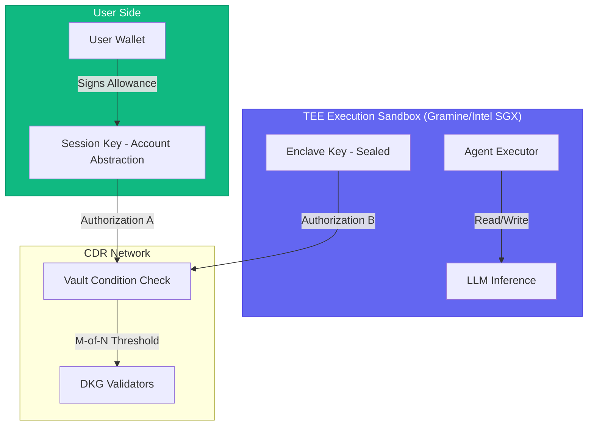

# TEE Double-Signer Architecture (Vision)

## Problem: Server-Signer Bottleneck

Currently, all CDR transactions (allocate, write, accessCDR) are signed by a single server-side private key (`WALLET_PRIVATE_KEY`). This means:

- The server operator **can read any vault** (trust assumption)
- Users cannot independently own their CDR vaults
- Not truly self-sovereign

## Solution: Dual Authorization via TEE + User Wallet

### Architecture

### Flow: Write (Encrypt & Store)

1. **User authorizes** via their wallet (MetaMask): signs a session key granting the TEE enclave limited write access
2. **TEE Enclave** boots with sealed key, attested via remote attestation (Intel DCAP / AMD SEV-SNP)
3. **Agent Executor** inside TEE:
   - Generates data (LLM response, analysis result)
   - Encrypts via CDR inside the enclave (data never leaves TEE in plaintext)
   - Signs the `write()` transaction with the enclave key
   - Sends to CDR network (msg.sender = enclave key)
4. **CDR Condition** checks: `msg.sender` is authorized enclave AND the `writeConditionData` contains user's session key signature → **DUAL AUTHORIZATION PASSED**

### Flow: Read (Decrypt & Consume)

1. **User requests** read via frontend → signs a read request with their wallet
2. **TEE Enclave** validates user signature, then:
   - Calls `accessCDR()` signed with enclave key
   - Validators check read condition: is `msg.sender` (enclave) authorized? Does the `accessAuxData` contain valid user signature?
3. On threshold met, data key is decrypted **inside the TEE**
4. TEE runs LLM inference on decrypted data
5. Only the **LLM response** (not the raw memory) is returned to the user

### Key Properties

| Property | How It's Achieved |
|----------|-------------------|
| **No single point of trust** | Both user wallet AND enclave must authorize every operation |
| **Data never exposed** | Decrypted memory stays inside TEE, only inference results leave |
| **Verifiable** | Remote attestation proves the TEE is running approved code |
| **Revocable** | User can revoke session key at any time on-chain |

### Implementation Path

1. Deploy a `TEEWriteCondition.sol` contract that checks dual signatures
2. Use Gramine SDK to build the TEE sandbox with sealed key storage
3. Integrate remote attestation (Intel DCAP) for trustless verification
4. Replace `skipConditionValidation: true` with real dual-auth condition checks

### Status

> This is an **architecture vision** document. The current implementation uses a simpler server-signer model for demo purposes. The TEE double-signer pattern is the production target.
